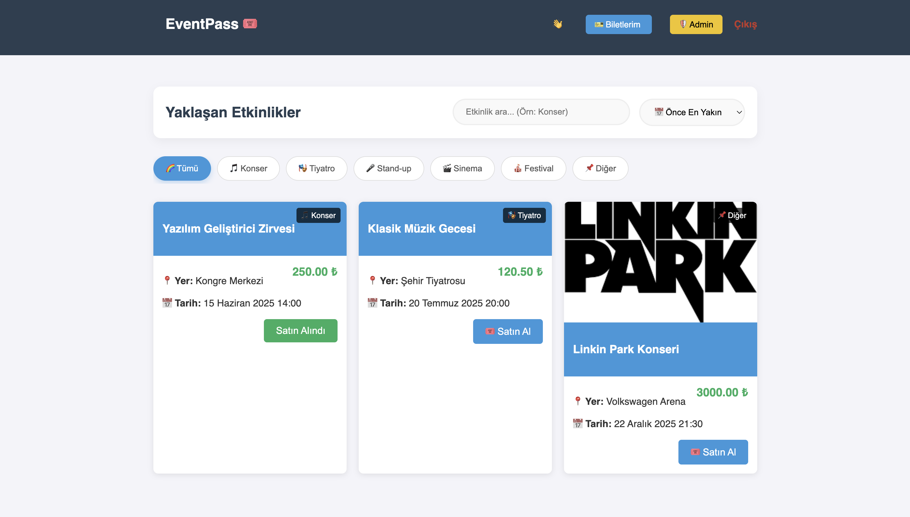
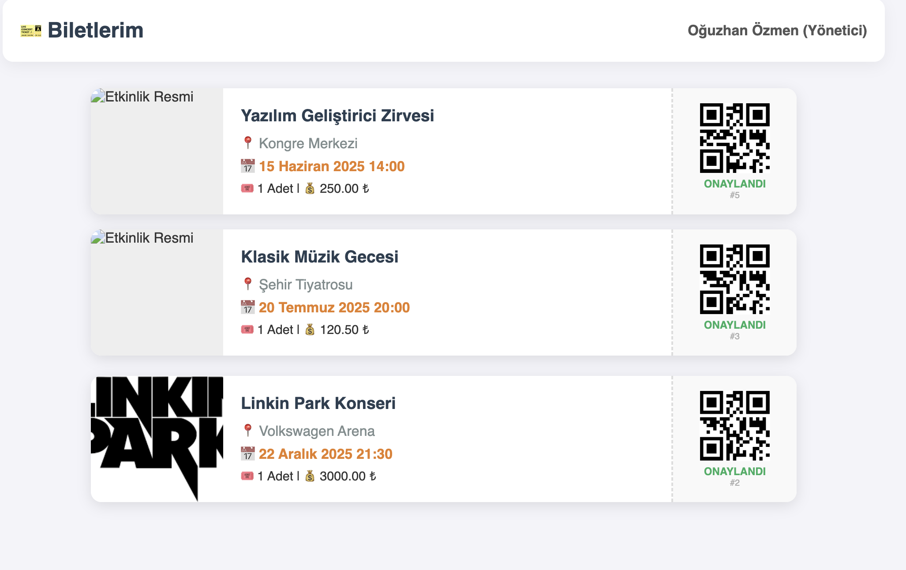
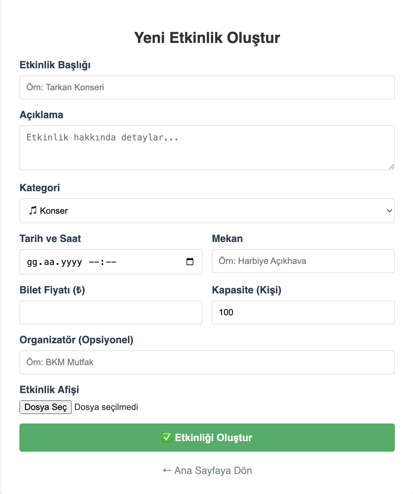

# 🎫 EventPass - Etkinlik Biletleme Sistemi

EventPass, kullanıcıların konser, tiyatro ve çeşitli etkinlikleri görüntüleyip bilet alabildiği, aynı zamanda yöneticilerin etkinlik ekleyip düzenleyebildiği modern bir web uygulamasıdır.

Proje, **Docker** üzerinde çalışan **Mikroservis** mimarisine uygun bir yapıda; Frontend, Backend ve Veritabanı servislerinin ayrı ayrı konteynerize edilmesiyle geliştirilmiştir.

---

## 📸 Uygulama Ekran Görüntüleri

Uygulamanın kullanıcı ve yönetici arayüzlerinden görünümler:

| 🏠 Ana Sayfa & Etkinlikler | 🎟️ Biletlerim Sayfası |
| :---: | :---: |
|  |  |

| 🛡️ Admin & Yönetim Paneli |
| :---: |
|  |

---

## 🚀 Özellikler

* **Etkinlik Listeleme:** Kategoriye (Konser, Tiyatro vb.) ve tarihe göre filtreleme.
* **Bilet Satın Alma:** Kullanıcı dostu arayüz ile hızlı bilet alımı.
* **Biletlerim:** Satın alınan biletlerin barkodlu şekilde listelenmesi.
* **Admin Paneli:** Yeni etkinlik ekleme, silme ve düzenleme yetkisi.
* **Tam Docker Desteği:** Tek komutla tüm sistemi (DB + API + Frontend) ayağa kaldırma.

## 🛠 Kullanılan Teknolojiler

* **Frontend:** HTML5, CSS3, JavaScript (Fetch API)
* **Backend:** PHP 8.2 (Apache Server)
* **Veritabanı:** PostgreSQL
* **DevOps:** Docker & Docker Compose
* **Versiyon Kontrol:** Git & GitHub

## ⚙️ Kurulum ve Çalıştırma

Bu projeyi kendi bilgisayarınızda çalıştırmak için **Docker**'ın kurulu olması yeterlidir.

**1. Repoyu Klonlayın**
```bash
git clone [https://github.com/KULLANICI_ADIN/EventPass1.git](https://github.com/KULLANICI_ADIN/EventPass1.git)
cd EventPass1